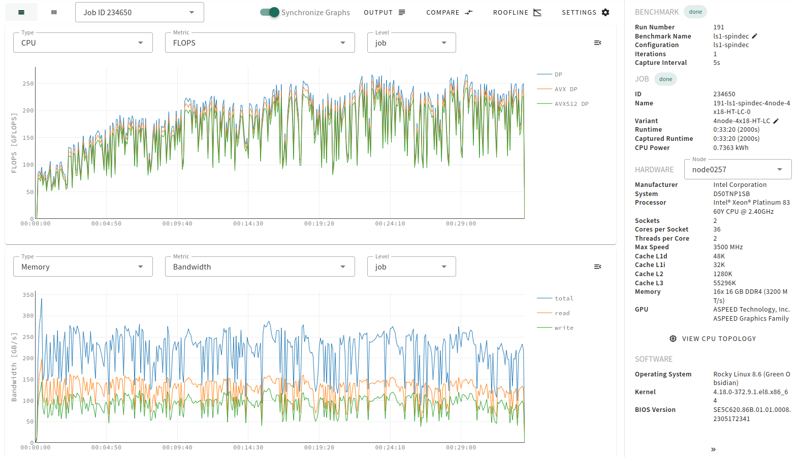

    
    
xbat - Extended Benchmarking Automation Tool

---

Simplify HPC application benchmarking and optimization. Dive deep into application performance with xbat - an easy to use, fully automated tool providing comprehensive metrics and insights for analysis and optimization.

    

Visit [xbat.dev](https://xbat.dev) for more information or try out our [demo](https://xbat.dev/docs/demo).

## Documentation

Detailed documentation is available for:

-   [**Users**](https://xbat.dev/docs/user/introduction)
-   [**Administrators**](https://xbat.dev/docs/admin/setup/installation)
-   [**Developers**](https://xbat.dev/docs/developer/contribute)

## Publications

<!-- KEEP IN SYNC WITH about.md -->

-   [**xbat: a continuous benchmarking tool for HPC software**](https://openhsu.ub.hsu-hh.de/entities/publication/16783) Nico Tippmann et al.
-   **xbat – An Easy-to-Use and Universally Applicable Benchmarking Automation Tool for HPC Software within the Project hpc.bw (dtec.bw)** - Poster to be presented at ISC 2025 by Willi Leinen et al.

## Acknowledgements

<!-- KEEP IN SYNC WITH about.md -->

We extend our heartfelt gratitude to everyone who contributed to the success of this project.

Special thanks to the members of the [dtec.bw](https://dtecbw.de/home) projects [MaST](https://www.hsu-hh.de/hpc/mast-consortium/) and [hpc.bw](https://www.hsu-hh.de/wb/hpc-bw), as well as the [High Performance Computing chair](https://www.hsu-hh.de/hpc/en/) at the Helmut-Schmidt University (HSU) Hamburg, for their invaluable contributions during the beta testing phase on the HSUper cluster. MaST and hpc.bw, funded by dtec.bw - Digitalization and Technology Research Center of the Bundeswehr. dtec.bw is funded by the European Union - NextGenerationEU.

We also thank [Microcard](https://www.microcard.eu/) for their support and continued usage within [openCARP](https://opencarp.org/) from the prototype phase of xbat, which played a crucial role in transforming xbat from a prototype into a fully realized solution.

## Funding

<!-- KEEP IN SYNC WITH about.md -->

This project has received funding from the European High-Performance Computing Joint Undertaking EuroHPC (JU) under grant agreement No 955495.
